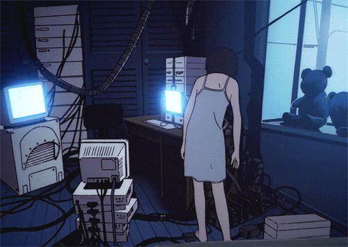

<!-- Banner estilo terminal - roxo escuro -->

<!-- Efeito de digitação (typing animation) - frases da Lain -->

 

<!-- Seu próprio gif/imagem aqui -->

 

### `> whoami`

- estudante de Ciencia e Tecnologia na UFSC (Universidade Federal de SC) 
- focada em programação e segurança ofensiva(red team)

### `> I code with`
 

 **Aprendendo agora:** Java
 
### `> stats`

  

### `> contact me`

 

<!-- Seu próprio gif/imagem aqui -->

 

